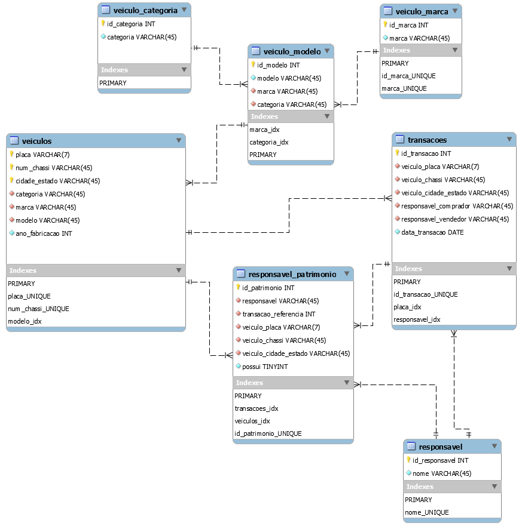

# Modelagem de Banco de Dados Relacional - um exercício.
O repositório a seguir é um breve exercício de modelagem de um banco de dados relacional, partindo de uma lista de requisitos de um caso de uso de fictício.

## Desafio #1

Desenhar um modelo de dados para o cadastro nacional de veículos. Sabe-se que:

I. O veículo possui sempre uma placa única em todo o país, além de um número de chassi e cidade/estado de vinculação;

II. O veículo possui sempre um responsável legal por ele. É necessário manter o histórico desta responsabilidade (propriedade);

III. O veículo pertence sempre a uma categoria;

IV. O veículo é sempre de uma marca e de um modelo e possui ano de fabricação;

V. Um representante legal pode possuir mais de um veículo.

## Desafio #2

Com base no modelo de dados da questão anterior, escreva uma query SQL que retorne as placas e estado/cidade de todos os veículos que estão cadastrados e cujo responsável legal chama-se “Matheus Berranteiro”.

## Solução

Para executar este desafio utilizei o MySQL Workbench, tanto para elaborar o ER Diagram como para validar o schema da database e a query.

Criei o esquema representado na imagem abaixo, observando os requisitos e restrições do desafio.

Crei 7 tabelas, respeitando os requisitos de normalização.

A query abaixo entrega a seleção solicitada no exercício:

`SELECT veiculo_placa, veiculo_cidade_estado FROM cadastro_nacional_veiculos.responsavel_patrimonio WHERE responsavel = "Laion Azeredo" AND possui = 1`

A nível de teste, criei dados dummy no schema. Para realizar o teste em sua máquina, basta importar o esquema para um banco local ou romoto através do aquivo [cadastro_nacional_veiculos_schema.sql](cadastro_nacional_veiculos_schema.sql) O script funciona perfeitamente em bancos MySQL Server, MariaDB e SQLite. 
Uma vez importado o schema, execute o arquivo [SQL_script_carros_do_Laion.sql](SQL_script_carros_do_Laion.sql).

O resultado deve ser:

|veiculo_placa|veiculo_cidade_estado|
|:-:	|---          	|
|AAA0489|Porto Alegre/RS|
|BBB1020|São Leopoldo/RS|

	

